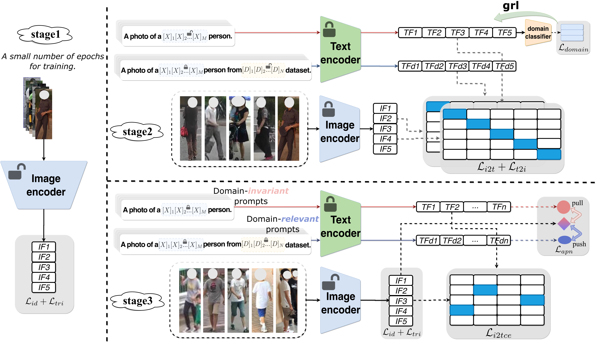

# CILP-FGDI: Exploiting Vision-Language Model for Generalizable Person Re-Identification

## Requirements

##### Our code is modified and organized based on [CLIP-ReID](https://github.com/Syliz517/CLIP-ReID).

Thanks for their contributions.

This is our code repository.

 You can run the project by modifying the corresponding configuration (cfg) files and using the run.py script.

## Experimental Result

We achieved the highest average performance across *three popular  experimental protocols* for **cross-domain person re-identification**.

