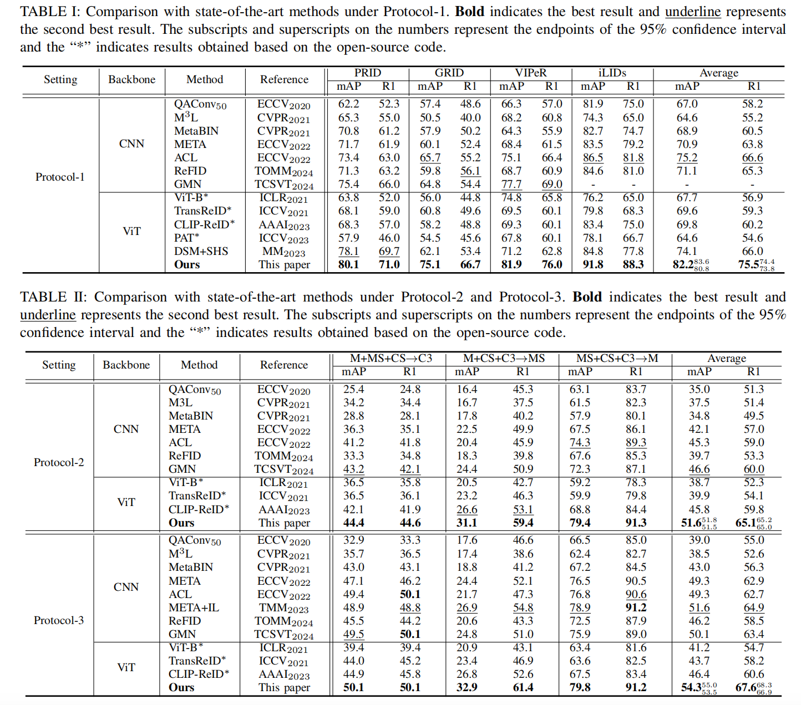

# CILP-FGDI: Exploiting Vision-Language Model for Generalizable Person Re-Identification


## Requirements

##### Our code is modified and organized based on [CLIP-ReID](https://github.com/Syliz517/CLIP-ReID).

Thanks for their contributions.

This is our code repository.

 You can run the project by modifying the corresponding configuration (cfg) files and using the run.py script.


## Experimental Result

We achieved the highest average performance across *three popular  experimental protocols* for **cross-domain person re-identification**.




## Trained Weights

|  Setting   | mAP \| Rank-1 |   Weights   |
| :--------: | :-----------: | :---------: |
| Protocol-1 | 82.2 \| 75.5  | coming soon |
| Protocol-2 | 51.6 \| 65.1  | coming soon |
| Protocol-3 | 54.3 \| 67.6  | coming soon |


# Citation

```tex
@article{10858181,
author = {Zhao, Huazhong and Qi, Lei and Geng, Xin},
title = {CILP-FGDI: Exploiting Vision-Language Model for Generalizable Person Re-Identification},
year = {2025},
journal = {IEEE Transactions on Information Forensics and Security},
}


```


